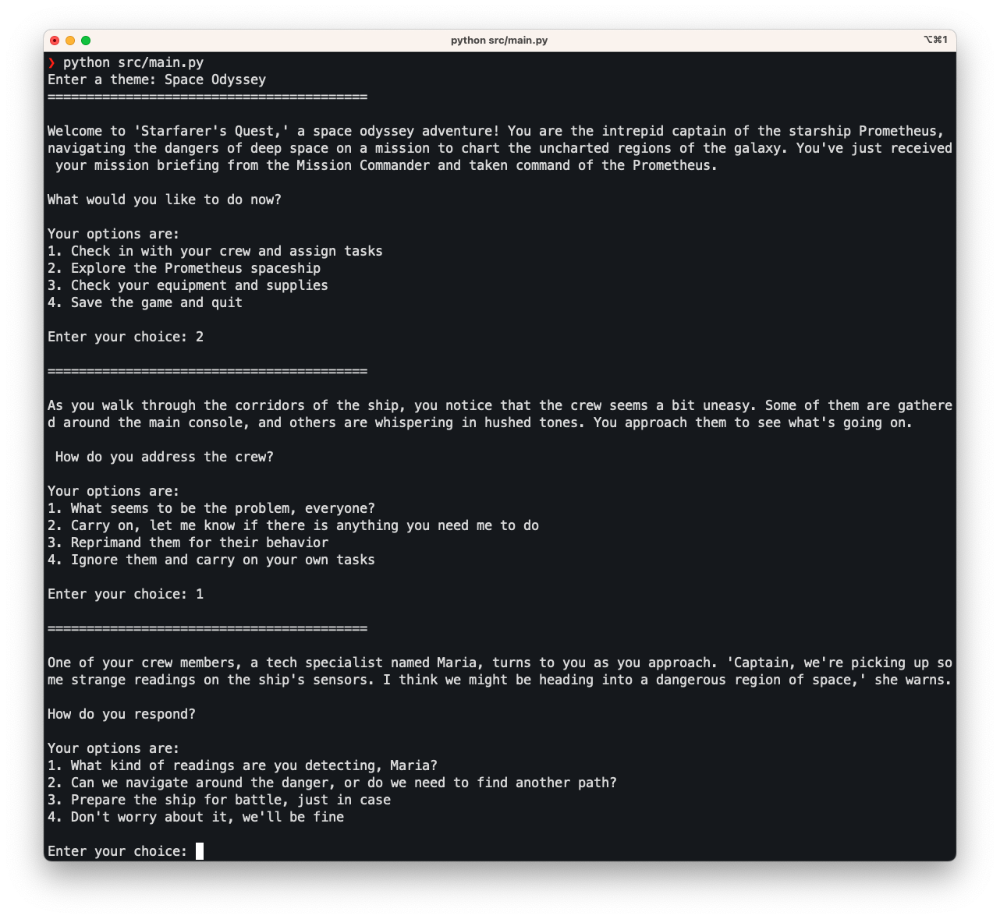

# gpt-text-adventure
> Play AI-generated text adventure games.

Endless text adventure games.
Most of them aren't that good, and you'll be lucky if one ever finishes.
Also, things break unexpectedly, sometimes.



## Installation

Clone the repo:

```sh
$ git clone https://github.com/somacdivad/gpt-text-adventure.git
```

Copy the `.env` file:

```sh
$ cd ~/gpt-text-adventure
$ cp .env.example .env
```

Open the `.env` file and add your OpenAI API key.

Install the requirements:

```sh
$ python -m pip install -r requirements.txt
```

## Playing the game

Run the `main.py` file:

```sh
$ python src/main.py
```

Enter a theme when you are prompted. Some examples of themes are:

1. Jungle Adventure
2. Haunted Mansion Mystery
3. Space Odyssey
4. Ancient Curse

From then on, just enter the number of the choice you select at each prompt until the game completes (it probably won't).

Good luck!
